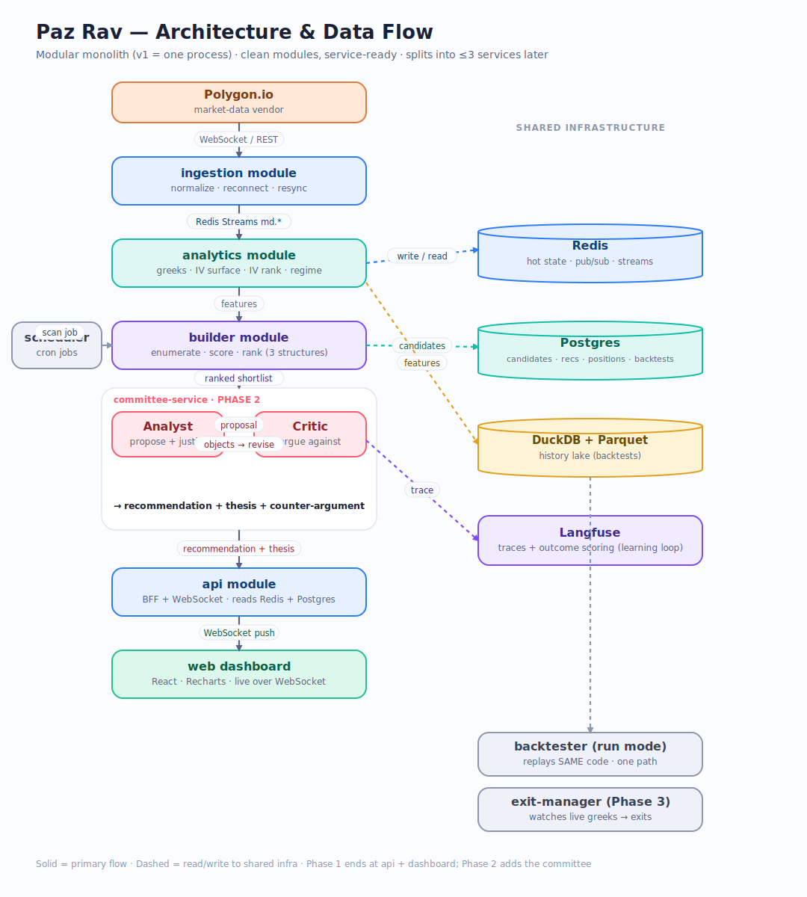
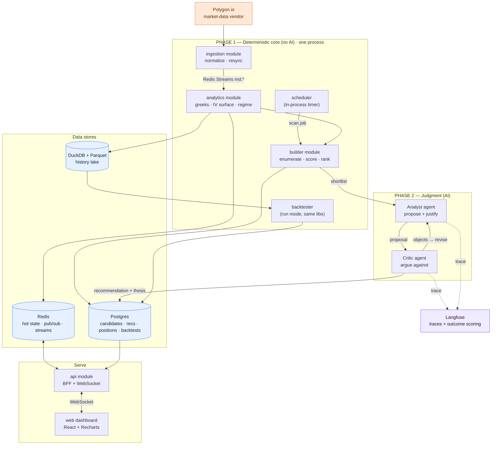
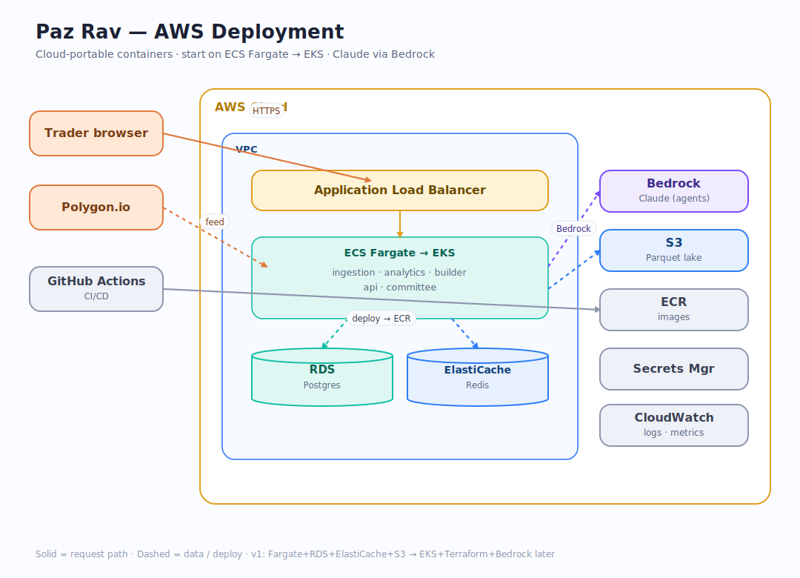
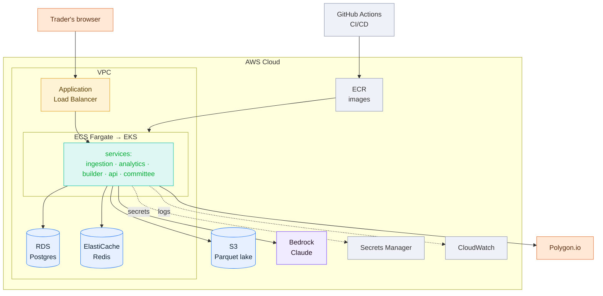

# Paz Rav — Real-Time Options Strategy Engine

> Finds the **right options strategy, at the right time, for the right duration** — and proves
> the edge in backtest before a dollar is risked. A deterministic quant core does all the math;
> a lean two-agent AI layer adds judgment and a full audit trail on top. Nothing on screen is
> guessed.

## 1. What it does
Continuously scans index options across a handful of underlyings, ranks defined-risk
premium-selling structures, and answers three questions — **what to trade, when, and for how
long** — each with a written rationale and a stated counter-argument.

The trader's real problem is three decisions, made continuously and without emotion:
- **Which structure** — iron condor vs. diagonal vs. double diagonal
- **When to enter** — only when the edge is actually present
- **How long to hold** — when to take profit, when to time-stop, when to cut a tested side

Humans do all three badly: they hold losers, cut winners, and sell into the wrong regime. This
system does them mechanically, at scale, with a full trace.

## 2. Principle #1 — numbers are computed, never guessed
Every greek, implied vol, probability, and P&L comes from **deterministic Python**. LLMs reason
*over* those numbers; they never produce them. An LLM asked for a delta will hallucinate — so the
quant core contains zero LLMs, and the AI layer only ever sees pre-computed, structured data.
This single rule is what makes the system both trustworthy and backtestable.

## 3. The three decisions, mapped to signals
| Decision | Driven by (deterministic) |
|---|---|
| **Which structure** | Vol environment: high IV rank + range-bound → iron condor; steep term structure → diagonal / calendar |
| **When to enter** | IV rank high (premium rich), regime not breaking out, no binary event near, liquidity adequate |
| **How long to hold** | Enter ~45 DTE; exit at ~50% of max profit, or at 21 DTE, or when a short side is tested |

All three are rules over computed features — so they can be **backtested and proven**, not
asserted.

## 4. Architecture
Three stages, one direction:

```
market data
   │
   ▼
[ CODE ]  ingest → features (greeks · IV surface · IV rank · term structure · regime)
   │
   ▼
[ CODE ]  enumerate & score structures (condor · diagonal · double-diagonal) → ranked shortlist
   │
   ▼
[ AGENT 1 · Analyst ] picks & justifies the best candidate in context ─┐
   │                                                                    │  LangGraph runs
   ▼                                                                    │  this loop
[ AGENT 2 · Critic ] argues against it, forces a bear case ────────────┘  (Critic objects →
   │                                                                       back to Analyst)
   ▼
recommendation + thesis + counter-argument
   │
   ▼
Langfuse traces everything  →  on trade close, real P&L is scored back  →  the system learns
```

1. **Deterministic engine (no AI).** Ingest, compute features, enumerate and score the three
   structures, emit a short ranked list.
2. **Two-agent judgment layer (AI).** Analyst proposes and justifies; Critic argues against and
   forces a bear case; they loop until they converge or escalate.
3. **Learning loop.** Every decision is traced; when the trade closes, its realized P&L is scored
   back onto the trace, so the system learns which judgments actually made money.

## 4A. Modular monolith, service-ready (honest deployment model)
This is **not** a microservices app, and deliberately so. For a solo v1, running 7 containers
would be over-engineering — pure ops cost with no benefit. Instead:

- **Logical modules (keep all).** The boxes below are clean code modules with strict boundaries
  — great organization, and they make future extraction cheap.
- **Deployable units (minimize).** v1 ships as **one process**. Modules talk by in-process
  function calls now; the *same* boundaries become network messages only if/when a module is
  extracted.

Some boxes aren't even services: **`scheduler`** is a tiny in-process timer (a component, not a
service), and **`backtester`** is a *run mode* that imports the same analytics + builder
libraries — not an always-on server.

**When each part earns its own process** — extract only on a real trigger, never "to look like
microservices":

| Extract | Trigger (the real reason) | Why it's a clean fault line |
|---|---|---|
| **Real-time engine** (ingestion + analytics) | The market feed must keep up and never be disturbed by a UI restart or a slow AI call | Always-on, I/O + CPU bound; different lifecycle from everything else |
| **api / web server** | You want to redeploy the dashboard without touching the trading engine | Request/response, user-facing, restarts often |
| **committee (LLM agents)** | Agent calls are slow/expensive; you want to scale or isolate them | Slowest tier — must never block ingestion; scales independently |

That's **at most three** deployables down the road — not seven — and only when the pain is real.
Everything else rides along. Because the module boundaries are already clean, each extraction is
mostly "swap a function call for a message," not a rewrite.



**Diagram (also renders live on GitHub):**



**Detailed flow (ASCII):**

```
┌──────────────┐
│  Polygon.io  │  external market-data vendor
└──────┬───────┘
       │  WebSocket / REST
       ▼
┌───────────────────────┐
│  ingestion-service    │  the ONLY service that talks to the vendor
│  normalize · resync   │  reconnect, sequence gaps, Redis-token rate limit
└──────┬────────────────┘
       │  Redis Streams:  md.underlying.*   ·   md.options.*
       ▼
┌───────────────────────┐      Redis (hot keys)  ─────────────────────────────┐
│  analytics-service    │ ───► greeks · IV surface · IV rank · term · regime   │
│  the accuracy core    │      pub/sub: ui.features                            │
└──────┬────────────────┘      DuckDB + Parquet lake (offline history)         │
       │  features (Redis / lake)                                             │
       ▼                                                                       │
┌───────────────────────┐   job (asyncio / Redis queue)   ┌───────────────┐   │
│   builder-service     │ ◄───────────────────────────────│  scheduler    │   │
│  enumerate · score    │                                 └───────────────┘   │
│  3 structures         │ ──► Postgres: candidates   +  pub/sub: ui.candidates │
└──────┬────────────────┘                                                      │
       │  ranked shortlist            (Phase 1 stops here — no AI yet)         │
       ▼                                                                       │
┌──────────────────────────────────────────────────────┐   Phase 2           │
│  committee-service                                    │                     │
│    ┌──────────┐   objects    ┌──────────┐             │   LangGraph loop    │
│    │ Analyst  │ ───────────► │  Critic  │             │   Langfuse traces   │
│    │ propose  │ ◄─────────── │  argue   │             │                     │
│    └──────────┘   revise     └──────────┘             │                     │
│    → recommendation + thesis + counter-argument       │                     │
└──────┬────────────────────────────────────────────────┘                     │
       │  Postgres: recommendations   +   pub/sub: ui.recs                    │
       ▼                                                                       │
┌───────────────────────┐        WebSocket / REST        ┌──────────────────┐ │
│     api-service        │ ─────────────────────────────►│  web dashboard   │ │
│  BFF + WS gateway      │ ◄──── Redis pub/sub, Postgres  └──────────────────┘ │
└───────────────────────┘ ◄─────────────────────────────────────────────────┘

  backtester-service      replays history through the SAME analytics + builder code
                          ──► Postgres: backtest_runs   (proves the edge; one code path)

  exit-manager-service    (Phase 3) watches open positions' live greeks in Redis
                          ──► "close / adjust" signals ──► alerts + pub/sub: ui.exits
```

**Transport legend** — `Redis Streams` = the market-data flow · `Redis pub/sub` = live push to
the dashboard · `asyncio / Redis queue` = scan/committee jobs · `Postgres` = durable state each
service owns · `HTTP / WebSocket` = the only thing the browser talks to.

**Rule:** a service owns its own storage; others read it only via its topic/API — never by
reaching into its database. That boundary is what keeps ingestion (must never drop a tick),
analytics (heavy math), and the committee (slow LLM calls) independently deployable and scalable.

## 5. Principle #2 — exactly two agents, and why
Not zero, not a committee of seven.
- **Why not zero?** A pure rule engine is a strong v1, but it can't weigh *conflicting,
  contextual* signals ("IV rank borderline, but FOMC in 3 days and term structure just
  inverted"). That synthesis, plus a written rationale, is real value — for your own trust and,
  later, for selling signals.
- **Why not one?** A model that both proposes and critiques itself in one breath is
  overconfident. Splitting **proposal** from **critique** into two separate calls measurably
  catches more bad trades. That separation — not "more agents" — is the entire point.
- **Why not more?** Extra LLM agents (Regime, Risk, PM) add cost and orchestration for judgment
  that deterministic rules already cover. They earn their place only when managing a correlated
  portfolio or selling signals to clients — a later phase, added only if measured to help.

**Analyst + Critic is the sweet spot: enough separation to cut error, little enough to stay
lean.**

## 6. Where LangGraph and Langfuse fit
- **LangGraph** manages exactly one thing: the Analyst ↔ Critic loop — shared state, the
  conditional "if the Critic objects, return to the Analyst," and a stop condition. Nothing else
  from LangChain is used; Claude is called directly via the Anthropic SDK. With a single agent
  LangGraph would be unnecessary — it earns its place *because* there are two agents in a loop.
- **Langfuse** is the most justified tool in the stack, valuable from the first day of the AI
  layer. It records every decision and — critically — lets you **score the outcome back** once a
  trade resolves. That closes the loop: you can ask *which regimes and prompts actually produce
  winning calls* and tune. It is the difference between a bot that picks trades and a system that
  learns.

## 7. Concurrency model
A real-time engine must never block. Three kinds of work, three kinds of worker:

| Work | Worker | Why |
|---|---|---|
| I/O — feed, API, dashboard push | single **asyncio** event loop | never blocks on the network |
| CPU — greeks, IV fit, Monte-Carlo | **process pool** | bypasses the GIL for real parallel math |
| LLM — Analyst, Critic | **async + `Semaphore(k)`** | calls are network I/O; the cap controls spend and rate limits |

The two agents run sequentially *per trade* (propose → critique), but many trades are judged in
parallel under the semaphore.

## 8. Tech stack (honest, phased)
**Essential — v1**
- Python 3.12, FastAPI, Pydantic, asyncio
- numpy, scipy, py_vollib (greeks / IV), polars
- Redis — hot state + pub/sub to the dashboard
- Postgres — candidates, recommendations, positions, backtest runs
- DuckDB + Parquet — backtest history (lean; no separate time-series DB yet)
- React + TypeScript, Recharts, Tailwind — the live dashboard
- Docker Compose — local, reproducible

**AI layer — Phase 2**
- Anthropic SDK (Claude) — direct model calls
- LangGraph — the Analyst ↔ Critic loop only
- Langfuse — tracing + outcome scoring (the learning loop)

**Deferred — added only on a real trigger**
- Kafka — only if/when backtest-replay parity at scale demands it (Redis Streams covers v1)
- pgvector — Phase 3 case memory (retrieve similar past setups)
- Kubernetes / Terraform / managed cloud — only when a single host is genuinely outgrown

**Deliberately not used** — RabbitMQ (an asyncio/Redis queue suffices on one machine); the broad
LangChain framework; MCP (plain typed Python functions give the same shared code path with less
indirection).

Data feeds (behind one `MarketData` port, Adapter pattern): **yfinance** — free, delayed,
for development; **Interactive Brokers** — real-time, the production feed. Swapping between
them is a one-line change. (Polygon/ThetaData remain drop-in options.)

> **Redis vs. Postgres, in one line:** Redis is *"what's true now"* — fast, in-memory hot state
> + pub/sub + streams (read the current greeks, push to the dashboard). Postgres is *"what
> happened"* — durable, queryable source of truth (candidates, recommendations, positions,
> backtests). Redis = the desk; Postgres = the filing cabinet.

## 8B. Cloud & AWS (portable by design, AWS-first)
Build cloud-neutral (containers + adapters), run locally on Docker Compose, deploy to **AWS**.
Because v1 is a **single process**, deployment is genuinely simple — you need one container, a
managed Postgres, a managed Redis, and a static site for the dashboard. Nothing more.

**Deploy in three stages (add only when the previous hurts):**
1. **Simplest start** — `AWS App Runner` (one container, no cluster to manage) + `RDS (Postgres)`
   + `ElastiCache (Redis)` + `S3 + CloudFront` (static dashboard). This is a real, cheap,
   production-grade deploy and still "AWS on the résumé".
2. **More control** — move the container to `ECS Fargate` behind an `ALB`; add `Terraform` (IaC)
   and `GitHub Actions` CI/CD; put Claude on `Bedrock`.
3. **Scale / platform signal** — `EKS` (Kubernetes) only when you split into the ≤3 services and
   scale genuinely demands it. This is the highest résumé signal — earned, not premature.

> **Alternative (simplest DX):** `GCP Cloud Run` + `Cloud SQL` + `Memorystore` is arguably the
> easiest one-container deploy anywhere. Everything here is cloud-portable, so choosing GCP over
> AWS is a config swap, not a rewrite. (Firebase is **not** a fit for this backend — it's for
> serverless mobile/web apps, not a long-running real-time Python engine.)

Full managed-service map (the target once you're past stage 1):



| Component | AWS service | Notes |
|---|---|---|
| Container(s) | **App Runner** → **ECS Fargate** → **EKS** | App Runner to start (no cluster); Fargate for control; EKS is the strongest résumé signal once scale justifies it |
| Postgres | **Amazon RDS** | managed Postgres |
| Redis | **Amazon ElastiCache** | managed Redis |
| Parquet lake | **Amazon S3** | object storage |
| Claude (agents) | **Amazon Bedrock** | Claude on AWS — the marketable "AWS + GenAI" combo (or Anthropic API directly) |
| Infra as code | **Terraform** | high résumé signal; portable to GCP/self-host |
| CI/CD | **GitHub Actions → AWS** | build → ECR → deploy |
| Images / secrets | **ECR** / **Secrets Manager** | — |
| Network / LB | **VPC + ALB** | ALB fronts api-service + dashboard |
| Monitoring | **CloudWatch** | logs + metrics |
| (deferred) Kafka / queue | **MSK** / **SQS** | only on the triggers in §8 |

**Honest sequencing:** start at stage 1 (`App Runner + RDS + ElastiCache + S3`) — cheap and real.
Move to Fargate/EKS + Terraform + Bedrock only when you want the highest-signal, most in-demand
skills (AI/Platform Engineer). Cloud-portable throughout, so GCP/self-host stays a config swap,
not a rewrite.



## 9. Repo layout
`src/` layout — the package lives under `src/paz_rav/` (imported as `paz_rav`), so nothing
at the repo root shares its name. `tests/`, `scripts/` (runnable demos), and `docs/` sit
alongside.
```
Paz-Rav/
  src/paz_rav/                                    # the package (import as `paz_rav`)
    adapters/     market-data ports (yfinance/IBKR)  # swap the feed without a rewrite      (Adapter)
    quant/        greeks · implied_vol · pop         # pure functions, no side effects — accuracy core
    analytics/    iv · regime · features             # turns chains into the Feature everything uses
    strategies/   base + iron_condor + registry      # one interface, N structures          (Strategy+Factory)
    builder/      annotate + enumerate + rank         # delta-based candidate builder
    store/        base + memory/redis/postgres        # storage behind an interface          (Repository)
    bus/          channels for live push              # pub/sub to the UI                     (Observer)
    contracts/    shared Pydantic schemas
    api/          FastAPI (+ WebSocket, Phase 1)
    config.py     typed settings from env
    agents/       analyst · critic · graph            # the two-agent loop (Phase 2)          (LangGraph)
  tests/          pytest suite (pure, no infra)
  scripts/        fetch_demo · analytics_demo · builder_demo   (run: PYTHONPATH=src python …)
  docs/           rendered architecture SVGs
```
Patterns doing the work: **Strategy** (interchangeable structures), **Factory** (build by name),
**Adapter** (swap vendor), **Repository** (swap storage), **Observer** (live push), and the
**proposer / critic** split in the AI layer.

## 9A. Running it (Phase 1)
```bash
# 1. Python deps (core + the free data feed)
pip install -e ".[feeds,dev]"        # or: pip install fastapi uvicorn pydantic-settings yfinance

# 2. Build the dashboard once
cd web && npm install && npm run build && cd ..

# 3. Run — serves the API, WebSocket and the built dashboard together
UNDERLYINGS=SPY uvicorn paz_rav.api.app:app --port 8000
#   → open http://localhost:8000
```
- **Frontend dev mode** (hot reload): `cd web && npm run dev` (Vite proxies `/api` + `/ws` to
  `:8000`), with the backend running separately.
- **No browser needed** — the CLI demos show the same pipeline:
  `PYTHONPATH=src python scripts/pipeline_demo.py SPY`
- **Tests:** `python -m pytest` (pure, no infra or network).
- Datastores (`docker compose up -d`) are optional in v1 — the app defaults to in-memory stores;
  point it at Redis/Postgres when you want persistence.

## 10. Roadmap
- **Phase 0 — Foundations:** ✅ repo (`src/` layout), Docker Compose, shared schemas, quant core.
- **Phase 1 — Deterministic core + dashboard (NO AI):**
  - ✅ feeds (yfinance/IBKR), analytics (IV, regime), builder (delta-based condors),
    storage (Redis/Postgres), wired pipeline + scheduler + bus, backtester.
  - ✅ FastAPI + WebSocket API and a **live React dashboard** (market overview, ranked
    candidates, payoff inspector) — verified running on real data.
  - **38 tests; whole engine runs end-to-end, no AI yet.**
- **Phase 2 — Two-agent judgment:** Analyst + Critic via LangGraph, traced in Langfuse; advisory
  alerts.
- **Phase 3 — Exit + learning loop:** mechanical exit manager, paper trading, outcome → Langfuse
  scoring, case memory.
- **Phase 4 — Hardening / optional live:** risk kill-switch, optional broker behind hard limits.

## 11. How we know it works
1. **Deterministic parity** — greeks / IV within tolerance vs. a vendor snapshot.
2. **Backtest = live parity** — the same history replayed live yields the same signals (one code
   path).
3. **Walk-forward backtest** — win-rate, avg P&L, max drawdown per strategy vs. a mechanical
   baseline.
4. **Trace audit** — every recommendation shows every number and the Critic's objection; zero
   un-sourced figures.
5. **Paper forward-test** — AI-layer P&L vs. baseline, scored onto traces.
