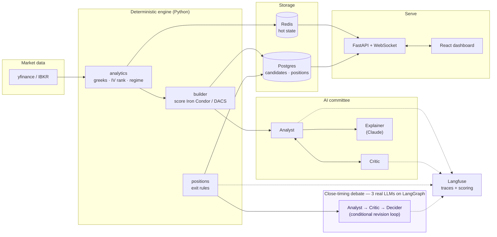
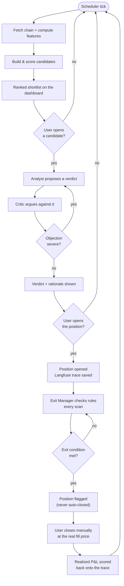
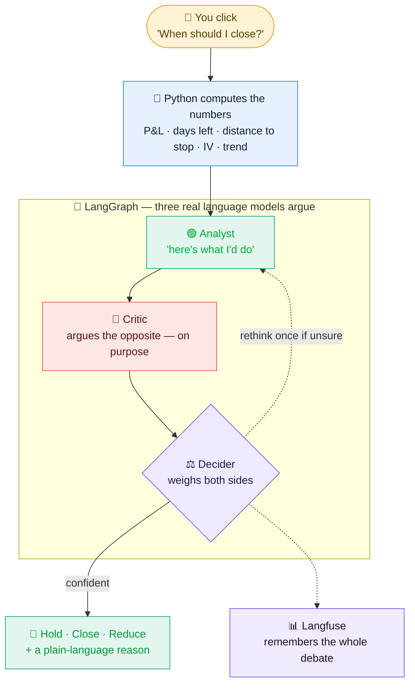

# Paz Rav — Real-Time Options Strategy Engine

> Finds the **right options strategy, at the right time, for the right duration** — and
> proves the edge in backtest before a dollar is risked. Deterministic Python does all
> the math; a lean AI layer adds judgment, a **genuine three-model debate on when to
> close**, and a full audit trail. Nothing on screen is guessed.

## What it does

Scans a fixed universe of underlyings, ranks **Iron Condor** and **DACS 1.0** candidates
deterministically, runs each past an AI committee (Analyst proposes, Critic argues
against), and serves a live dashboard where you open paper positions. When you ask
**"when should I close this?"**, three real language models debate it — an Analyst, a
Critic who argues the opposite, and a Decider who weighs both — over numbers Python has
already computed.

**The one rule that matters:** every greek, IV, price, POP, and P&L comes from
deterministic Python — the AI only ever reasons over numbers already computed, never
invents one. See [`docs/ARCHITECTURE.md`](docs/ARCHITECTURE.md) for why.

## System at a glance



## How a trade flows through the system



## "When should I close?" — a real three-model debate

This is the one place a language model is trusted to *reason toward a decision*, not just
phrase one. Think of it like **asking three advisors before selling a house** 🏠:

- 🟢 the **Analyst** says what he'd do,
- 🔴 the **Critic** deliberately argues the *opposite*, so nothing is missed,
- ⚖️ the **Decider** listens to both and calls it — and if he's *not sure*, he sends it
  back to the Analyst to think again, once.

Crucially, **the three only ever argue over numbers Python already computed** (profit so
far, days left, distance to the stop, volatility, recent price move) — they never invent a
number. **LangGraph** runs the loop; **Langfuse** remembers every debate.



**Advisory only** — like the rest of the system, it never closes anything itself; the real
fill happens at your broker. Repeated dashboard refreshes are served from a cache keyed on
the market state, so the debate only re-runs when something material changes (or you click
"check now").

## Quick start

```bash
docker compose up -d --build
# → open http://localhost:8000
```

One command, the whole stack (Postgres + Redis + the engine + dashboard). Runs on
offline demo data by default; set `PAZ_DATA=yfinance` for live delayed quotes. Full
options (running from source, real persistence, cloud deployment) are in
[`docs/DEPLOYMENT.md`](docs/DEPLOYMENT.md).

## Status

| Phase | What | State |
|---|---|---|
| 1 | Deterministic core + live dashboard | ✅ done |
| 2 | Two-agent AI judgment (Analyst + Critic, LangGraph, Langfuse) | ✅ done |
| 3 | Position lifecycle + advisory exit alerts | ✅ done |
| 3.5 | **Close-timing debate — 3 real LLMs (Analyst/Critic/Decider) on LangGraph** | ✅ done |
| 4 | Real broker connection, hardening | ⏳ not started |

Details, what's proven vs. what's a known gap, and backtest results:
[`docs/ROADMAP.md`](docs/ROADMAP.md).

## Learn more

- [**`docs/ARCHITECTURE.md`**](docs/ARCHITECTURE.md) — the reasoning behind the diagrams
  above: why two agents (not zero, not seven), why a modular monolith, the tech stack,
  repo layout.
- [**`docs/DEPLOYMENT.md`**](docs/DEPLOYMENT.md) — running it (Docker or from source),
  real persistence, cloud deployment stages.
- [**`docs/ROADMAP.md`**](docs/ROADMAP.md) — phase-by-phase status and how we verify it
  actually works.
- [**`CLAUDE.md`**](CLAUDE.md) — commands and architecture notes for AI coding agents
  working in this repo.
