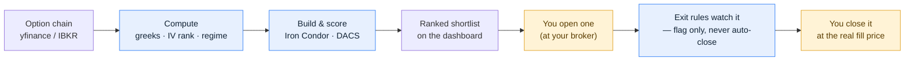

# Paz Rav

**Finds options trades where the odds are on your side — and shows its work.**

Paz Rav watches a handful of stocks and indexes, builds every sensible **Iron Condor** and
**DACS** position it can from the live option chain, ranks them, and puts the best ones on a
dashboard. You place the trade at your own broker. The system then tracks it, raises a flag
when its exit rules fire, and — when you ask — has three AI models argue about whether now
is the moment to close.

**The one rule the whole project is built on:** every number on screen — greeks, IV,
probability of profit, P&L — is computed by plain Python. The AI never invents a figure. It
only reasons *about* numbers that were already computed. That's the difference between a
tool you can audit and a chatbot wearing a stock ticker.

```bash
docker compose up -d --build   # → http://localhost:8000
```

That's Postgres, Redis, the engine and the dashboard, on offline demo data. Set
`PAZ_DATA=yfinance` first for live delayed quotes.

## What happens on every tick


```mermaid
flowchart LR
    FEED["Option chain<br/>yfinance / IBKR"] --> ANALYTICS["Compute<br/>greeks · IV rank · regime"]
    ANALYTICS --> BUILDER["Build & score<br/>Iron Condor · DACS"]
    BUILDER --> RANK["Ranked shortlist<br/>on the dashboard"]
    RANK --> OPEN["You open one<br/>(at your broker)"]
    OPEN --> WATCH["Exit rules watch it<br/>— flag only, never auto-close"]
    WATCH --> CLOSE["You close it<br/>at the real fill price"]

    classDef py fill:#e7f0fe,stroke:#2e7df6,color:#123;
    classDef you fill:#fff3d6,stroke:#e0a020,color:#5a3d00;
    class ANALYTICS,BUILDER,WATCH py;
    class OPEN,CLOSE you;
```

One function — `Pipeline.run_once()` — does all of it. The scheduler calls it on a timer;
the backtester replays history through the *same* function. That's what makes backtest and
live results comparable instead of two codebases that drift apart.

## Where the AI is actually allowed to think

Most of the "AI" here isn't AI at all, on purpose. The always-on filter that vets every
candidate (Analyst proposes, Critic argues back) is deterministic rule code — free, instant,
testable. The plain-language explanation of each position is a fixed template, because a
small model writing prose *containing numbers* will eventually get one slightly wrong.

Language models get exactly two jobs, both on demand and both advisory:

- **"Should I open this?" / "Should I close this?"** — three Claude calls debate it: an
  Analyst, a Critic who argues the opposite on purpose, and a Decider who weighs both. They
  only ever see numbers Python already computed, and structured tool-use means they can't
  return free-form prose or a made-up figure.
- **"How am I doing overall?"** — a reflection pass reads the aggregate stats of your closed
  trades and suggests what to tune. It never tunes anything itself.

Nothing here ever places or closes an order. Every fill is yours, at your broker.

## Status — the honest version

| | |
|---|---|
| ✅ Works today | Quant core, candidate ranking, live dashboard, position tracking, exit alerts, the AI debates, Postgres/Redis persistence. 106 tests, no infra or network needed. |
| ⚠️ Proven only in simulation | The Iron Condor backtest wins 92.5% — but on synthetic chains deliberately priced above realized vol, so it largely confirms its own premise. Not yet validated on real historical chains. |
| ❌ Known gaps | DACS is negative in backtest (it's held passively to expiry, which isn't how it's meant to be traded). No real broker connection. Nothing deployed to cloud. |

## Learn more

- [`docs/ARCHITECTURE.md`](docs/ARCHITECTURE.md) — how it's put together and why.
- [`docs/MONOREPO.md`](docs/MONOREPO.md) — the two halves, the shared database, and what
  is not merged yet.
- [`docs/DEPLOYMENT.md`](docs/DEPLOYMENT.md) — running it, for real and for development.
- [`docs/ROADMAP.md`](docs/ROADMAP.md) — what's done, what's next, what we actually know.
- [`CLAUDE.md`](CLAUDE.md) — day-to-day notes for AI coding agents in this repo.

## Disclaimer

This project is provided as is, without warranty of any kind, and is **not investment advice**.
It was built for my own research and use. Options trading carries substantial risk of loss - you
are solely responsible for anything this software does with your account. Use at your own risk.
