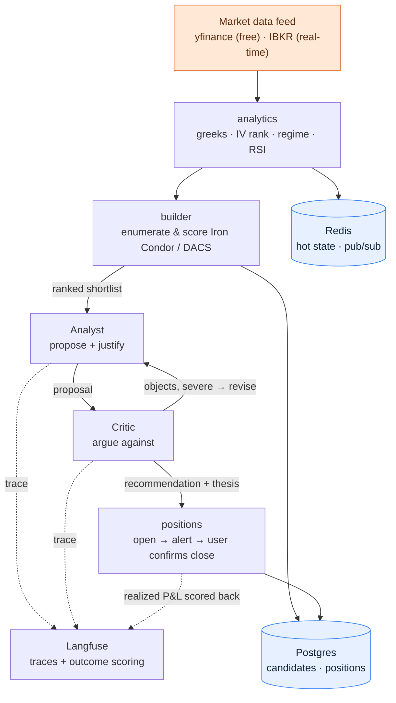

# Architecture

## The pipeline

One direction, no AI until the last step:



1. **Deterministic engine (no AI).** Ingest a chain, compute features (greeks, IV rank,
   regime, RSI), enumerate and score Iron Condor + DACS candidates.
2. **Two-agent judgment (AI).** Analyst proposes a verdict (take / caution / pass) with a
   rationale; Critic argues the bear case. A severe objection sends a "take" back to the
   Analyst for one revision (a real LangGraph loop, not just two sequential calls).
3. **Positions + learning loop.** Opening a position captures the committee's Langfuse
   trace id. The Exit Manager never closes a position itself — it only flags it
   (`profit_target` / `stop_loss` / `time_stop`) since the real fill happens at your
   broker. When you confirm the close with the real price you got, the realized P&L
   scores back onto that exact trace — so you can eventually ask *which regimes and
   verdicts actually made money.*

`Pipeline.run_once()` (`src/paz_rav/pipeline.py`) is the one function that does all of
this — the scheduler drives it on a loop live, and the backtester replays history through
the *same* function, which is what guarantees live/backtest parity.

## Why a modular monolith, not microservices

This ships as **one process**, deliberately. For a solo project, running 7 containers is
pure ops cost with no benefit. What's true instead:

- **Modules are strict** (`adapters`, `analytics`, `strategies`, `builder`, `agents`,
  `positions`, `store`, `api`) — clean boundaries, so splitting one out later is cheap.
- **Deployment is not.** Modules talk via in-process calls today; the same boundaries
  become network calls only if a module is actually extracted.

Some things that look like services in the diagram aren't: the **scheduler** is an
in-process timer, and the **backtester** is a run mode that imports the same libraries —
neither is an always-on server.

**Extract only on a real trigger:**

| Extract | Trigger | Why it's a clean fault line |
|---|---|---|
| Real-time engine (feed + analytics) | Must never drop a tick; can't be disturbed by a UI restart or a slow AI call | Always-on, different lifecycle from everything else |
| API / web server | Want to redeploy the dashboard without touching the trading engine | Request/response, restarts often |
| Committee (LLM agents) | Agent calls are slow/expensive; want to scale independently | Slowest tier — must never block ingestion |

At most three deployables, only when the pain is real — not seven, and not on day one.

## Why exactly two agents

Not zero, not a committee of seven.

- **Why not zero?** A pure rule engine can't weigh conflicting contextual signals ("IV
  rank borderline, but FOMC in 3 days and term structure just inverted"). That synthesis,
  plus a written rationale, is real value.
- **Why not one?** A model that proposes *and* critiques itself in one breath is
  overconfident. Splitting proposal from critique into two separate calls measurably
  catches more bad trades — that separation is the entire point of "multi-agent" here.
- **Why not more?** Extra agents (Regime, Risk, PM) add cost for judgment deterministic
  rules already cover. They'd earn their place only when managing a correlated portfolio
  or selling signals to clients — not needed yet.

**Where LangGraph and Langfuse fit:** LangGraph manages exactly one thing — the
Analyst↔Critic loop, shared state, and the "if Critic objects, go back to Analyst"
condition. Nothing else from LangChain is used; Claude is called directly via the
Anthropic SDK. Langfuse is the most justified tool in the stack: it traces every decision
and lets you score the realized outcome back onto it later — the difference between a
bot that picks trades and a system that learns which of its own judgments were good.

## Concurrency model

Three kinds of work, three kinds of worker — a real-time engine must never block:

| Work | Worker | Why |
|---|---|---|
| I/O — feed, API, dashboard push | single `asyncio` event loop | never blocks on the network |
| CPU — greeks, IV fit, Monte-Carlo | process pool | bypasses the GIL |
| LLM — Analyst, Critic | async + `Semaphore(k)` | calls are network I/O; the cap controls spend and rate limits |

## Tech stack (honest, phased)

**Essential — in use today**
- Python 3.12, FastAPI, Pydantic, asyncio
- numpy, scipy, py_vollib, polars (the quant core also has pure-Python fallbacks, so
  tests never need these)
- Redis — hot state + pub/sub to the dashboard
- Postgres — candidates, positions
- React + TypeScript, Recharts, Tailwind — the live dashboard
- Docker Compose — local, reproducible, and the same image path to the cloud

**AI layer**
- Anthropic SDK (Claude) — direct calls, no framework
- LangGraph — the Analyst↔Critic loop only
- Langfuse — tracing + outcome scoring

**Deferred — added only on a real trigger**
- Kafka — only if/when backtest-replay parity at real scale demands it (Redis Streams
  covers today)
- pgvector — case-memory (retrieve similar past setups) once there's a real body of
  outcomes to retrieve against
- Kubernetes / Terraform-in-anger / managed cloud — only when a single host is genuinely
  outgrown (see `docs/DEPLOYMENT.md`)

**Deliberately not used** — RabbitMQ (an asyncio/Redis queue suffices on one machine);
the broad LangChain framework; MCP (plain typed Python functions give the same shared
code path with less indirection).

**Data feeds** (behind one `MarketData` Adapter): **yfinance** — free, delayed, for
development; **Interactive Brokers** — real-time, the intended production feed, stubbed
in `adapters/ibkr.py` but not wired yet. Swapping is a one-line change.

> **Redis vs. Postgres, in one line:** Redis is *"what's true now"* (hot state, pub/sub).
> Postgres is *"what happened"* (durable, queryable). Redis is the desk; Postgres is the
> filing cabinet.

## Repo layout

```
Paz-Rav/
  src/paz_rav/
    adapters/     market-data ports (yfinance/IBKR)       Adapter
    quant/        greeks · implied_vol · pop · valuation   pure functions — the accuracy core
    analytics/    iv · regime · rsi · features             turns chains into one Feature
    strategies/   base + iron_condor + dacs + registry     Strategy + Factory
    builder/      annotate + enumerate + rank
    agents/       analyst · critic · graph · explainer     the two-agent loop (LangGraph)
    positions/    base + exit_rules + exit_manager         advisory-only lifecycle
    store/        base + memory/redis/postgres             Repository
    bus/          channels for live push                   Observer
    contracts/    shared Pydantic schemas
    api/          FastAPI + WebSocket
  tests/          pytest suite (pure, no infra)
  scripts/        runnable demos (pipeline/builder/backtest)
  web/            React dashboard
  infra/terraform/  AWS scaffold (not applied — see docs/DEPLOYMENT.md)
```

Patterns doing the work: **Strategy** (interchangeable structures), **Factory** (build by
name), **Adapter** (swap vendor), **Repository** (swap storage), **Observer** (live push).
